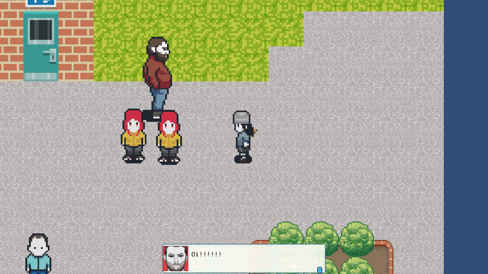
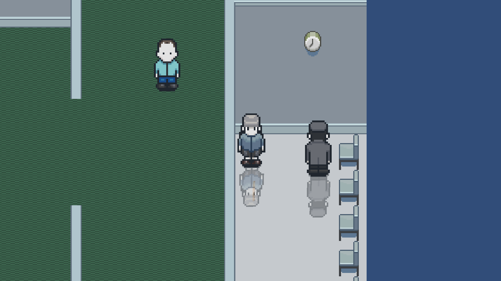

# action-rpg-2016-archive
C# and other files for an old Unity project - for memories.

Full of rubbish from 2016, probably some of the earliest code I've written that I've still got access to but I was really happy at the time. 
Looking back at it is pretty funny though.

Press Z to interact. X to attack. Launch the game from the executable in the bin/ directory.
